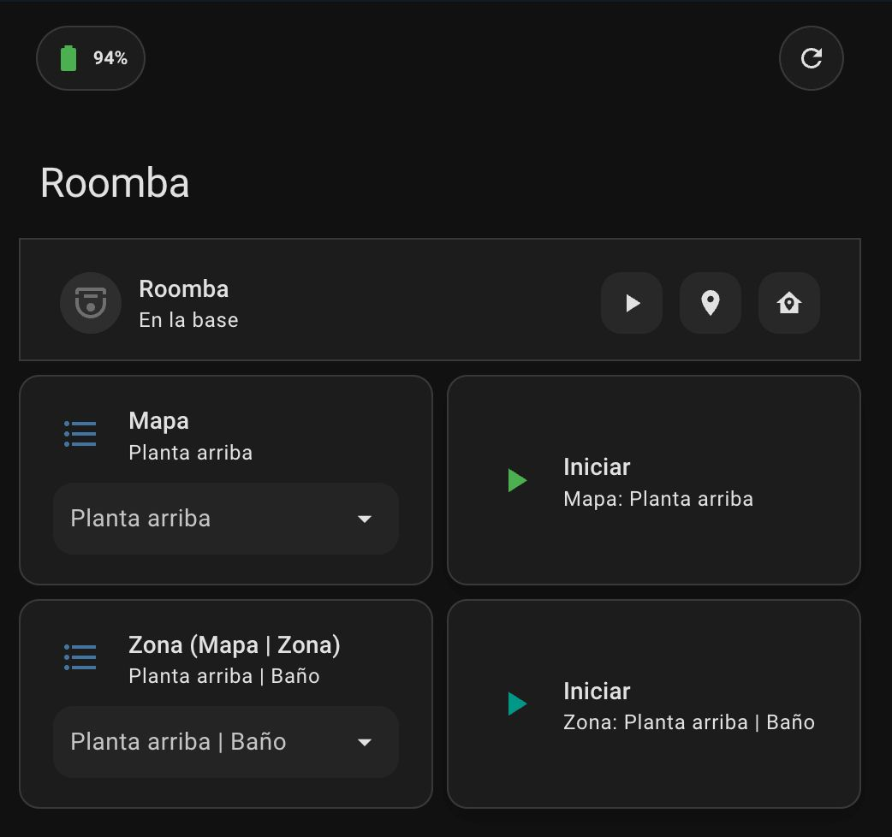

# Lovelace Dashboard Example for Kobold VR7



The following example shows how to build a Lovelace subview dedicated to a Kobold VR7 robot. It combines Mushroom cards, template helpers, and Home Assistant automations so you can quickly start map or zone cleanups straight from the dashboard. The layout places quick status chips on top and contextual controls underneath so you can launch map or zone cleanups while the robot is docked.

> **Tip:** The configuration below assumes you are using [Mushroom cards](https://github.com/piitaya/lovelace-mushroom) and have already installed the `card-mod` custom card.

> **Important:** Every YAML snippet references `vacuum.roomba` as the sample robot entity. Replace that entity ID with the one exposed by your own Kobold VR7 (for example, `vacuum.kobold_vr7_living_room`).

## 1. Subview configuration

Add the subview to your Lovelace dashboard (either through the UI editor or by editing `ui-lovelace.yaml`). The view keeps the battery and quick actions on top, followed by context-sensitive controls when the robot is docked.

```yaml
title: Roomba
path: roomba
icon: mdi:robot-vacuum
subview: true
type: masonry
badges: []
cards:
  - type: custom:mushroom-chips-card
    alignment: justify
    chips:
      - type: template
        icon: mdi:battery
        icon_color: >
           {{ 'red' if b < 20
          else 'amber' if b < 50 else 'green' }}
        content: "{{ states('sensor.roomba_bateria')|int(0) }}%"
      - type: action
        icon: mdi:refresh
        name: Lists
        tap_action:
          action: perform-action
          perform_action: automation.trigger
          target:
            entity_id:
              - automation.vr7_populate_maps
              - automation.vr7_populate_all_zones
          data:
            skip_condition: true
    card_mod:
      style: |
        ha-card {
          padding: 6px 10px;
          border-radius: 16px;
          box-shadow: var(--ha-card-box-shadow, 0 2px 10px rgba(0,0,0,.08));
        }
  - type: vertical-stack
    cards:
      - type: custom:mushroom-title-card
        title: Roomba
        card_mod:
          style: |
            ha-card {
              padding: 12px 16px;
              border-radius: 18px 18px 0 0;
              box-shadow: none;
              background: linear-gradient(135deg, rgba(0,150,136,.08), transparent);
            }
      - type: custom:mushroom-vacuum-card
        entity: vacuum.roomba
        icon_animation: true
        commands:
          - on_off
          - start_pause
          - return_home
          - locate
        fill_container: true
        layout: horizontal
        card_mod:
          style: |
            ha-card {
              border-radius: 0;
              padding: 10px 14px 6px 14px;
              box-shadow: none;
            }
      - type: conditional
        conditions:
          - entity: vacuum.roomba
            state: docked
        card:
          type: vertical-stack
          cards:
            - type: horizontal-stack
              cards:
                - type: tile
                  entity: input_select.vr7_map
                  name: Map
                  vertical: false
                  features:
                    - type: select-options
                  features_position: bottom
                  card_mod:
                    style: |
                      ha-card { border-radius: 12px; padding: 6px 8px; }
                - type: conditional
                  conditions:
                    - entity: sensor.vr7_selected_map_name
                      state_not: —
                    - entity: sensor.vr7_selected_map_name
                      state_not: ""
                    - entity: sensor.vr7_selected_map_name
                      state_not: unknown
                    - entity: sensor.vr7_selected_map_name
                      state_not: unavailable
                  card:
                    type: custom:mushroom-template-card
                    primary: Start
                    secondary: "Map: {{ states('sensor.vr7_selected_map_name') }}"
                    icon: mdi:play
                    icon_color: green
                    tap_action:
                      action: call-service
                      confirmation: true
                      service: script.vr7_clean_selected_map
                    fill_container: false
                    card_mod:
                      style: |
                        ha-card {
                          border-radius: 12px;
                          padding: 8px 12px;
                          min-width: 120px;
                          box-shadow: var(--ha-card-box-shadow, 0 6px 18px rgba(0,0,0,.08));
                        }
            - type: horizontal-stack
              cards:
                - type: tile
                  entity: input_select.vr7_zone
                  name: Zone (Map | Zone)
                  vertical: false
                  features:
                    - type: select-options
                  features_position: bottom
                  card_mod:
                    style: |
                      ha-card { border-radius: 12px; padding: 6px 8px; }
                - type: conditional
                  conditions:
                    - entity: input_select.vr7_zone
                      state_not: —
                    - entity: input_select.vr7_zone
                      state_not: ""
                  card:
                    type: custom:mushroom-template-card
                    primary: Start
                    secondary: "Zone: {{ states('input_select.vr7_zone') }}"
                    icon: mdi:play
                    icon_color: teal
                    tap_action:
                      action: call-service
                      confirmation: true
                      service: script.vr7_clean_selected_zone
                    fill_container: false
                    card_mod:
                      style: |
                        ha-card {
                          border-radius: 12px;
                          padding: 8px 12px;
                          min-width: 120px;
                          box-shadow: var(--ha-card-box-shadow, 0 6px 18px rgba(0,0,0,.08));
                        }
    card_mod:
      style: |
        ha-card {
          border-radius: 18px;
          overflow: hidden;
          box-shadow: 0 8px 24px rgba(0,0,0,.10);
          background: var(--card-background-color);
        }
```

## 2. Automations

These automations keep the map and zone selectors in sync with the latest data exposed by the integration. Add them to `automations.yaml` (or create them via the UI using the YAML editor).

```yaml
- id: vr7_populate_maps
  alias: "VR7 · Populate Maps"
  mode: restart
  trigger:
    - platform: homeassistant
      event: start
    - platform: state
      entity_id: vacuum.roomba
      attribute: maps
  action:
    - variables:
        maps_attr: "{{ state_attr('vacuum.roomba','maps') }}"
        maps: >-
          
            {{ maps_attr }}
          
            {{ maps_attr | from_json }}
          
            {{ {} }}
          
        names: "{{ maps.values() | list }}"
    - service: input_select.set_options
      target:
        entity_id: input_select.vr7_map
      data:
        options: "{{ (['—'] + names) if (names|length > 0) else ['—'] }}"
    - choose:
        - conditions: "{{ names|length > 0 }}"
          sequence:
            - service: input_select.select_option
              target:
                entity_id: input_select.vr7_map
              data:
                option: "{{ names[0] }}"

- id: vr7_populate_all_zones
  alias: "VR7 · Populate All Zones (Map | Zone)"
  mode: restart
  trigger:
    - platform: homeassistant
      event: start
    - platform: state
      entity_id: vacuum.roomba
      attribute: zones
  action:
    - variables:
        zones_attr: "{{ state_attr('vacuum.roomba','zones') }}"
        zones: >-
          
            {{ zones_attr }}
          
            {{ zones_attr | from_json }}
          
            {{ {} }}
          
        flat: >-
          
          
            
              
              
            
          
          {{ ns.items }}
    - service: input_select.set_options
      target:
        entity_id: input_select.vr7_zone
      data:
        options: "{{ (['—'] + flat) if (flat|length > 0) else ['—'] }}"
    - choose:
        - conditions:
            - condition: template
              value_template: "{{ flat|length > 0 }}"
          sequence:
            - service: input_select.select_option
              target:
                entity_id: input_select.vr7_zone
              data:
                option: "{{ flat[0] }}"
```

## 3. Scripts

Store these scripts in `scripts.yaml`. They call the integration services with the UUIDs selected from the helper dropdowns.

```yaml
vr7_clean_selected_map:
  alias: "VR7 · Clean Selected Map"
  mode: single
  sequence:
    - service: kobold_vr7.clean_map
      target:
        entity_id: vacuum.roomba
      data:
        map_uuid: "{{ states('sensor.vr7_selected_map_uuid') }}"

vr7_clean_selected_zone:
  alias: "VR7 · Clean Selected Zone"
  mode: single
  sequence:
    - service: kobold_vr7.clean_zone
      target:
        entity_id: vacuum.roomba
      data:
        zones_uuid: "{{ states('sensor.vr7_selected_zone_uuid') }}"
```

## 4. Template sensors

Add the template sensors to `configuration.yaml` (or a dedicated templates file) to resolve the map and zone UUIDs based on the selected helper values.

```yaml
sensor:
  - platform: template
    sensors:
      vr7_selected_map_name:
        friendly_name: "VR7 map name (from selection)"
        value_template: >-
          
          
            {{ zone_sel.split(' | ', 1)[0] | trim }}
          
            
            {{ map_sel if map_sel and map_sel != '—' else '' }}
          

      vr7_selected_zone_name:
        friendly_name: "VR7 zone name (from selection)"
        value_template: >-
          
          
            {{ zone_sel.split(' | ', 1)[1] | trim }}
          
            {{ '' }}
          

      vr7_selected_map_uuid:
        friendly_name: "VR7 map UUID"
        value_template: >-
          
          
          
          
            
              
                {{ uuid }}
              
            
          

      vr7_selected_zone_uuid:
        friendly_name: "VR7 zone UUID"
        value_template: >-
          
          
          
          
          
            
            
              
              
                {{ zone.zone_uuid }}
              
            
          
```

## 5. Input selects

Create the helper dropdowns in `configuration.yaml` (or via **Settings → Devices & services → Helpers** using the YAML import option).

```yaml
input_select:
  vr7_map:
    name: VR7 Map
    options:
      - "—"  # initial placeholder

  vr7_zone:
    name: VR7 Zone
    options:
      - "—"  # initial placeholder
```

With the helpers, sensors, scripts, and automations in place, the Lovelace subview will present a streamlined workflow: pick a map or zone, review the selection, and launch the appropriate cleaning routine with a single tap.
